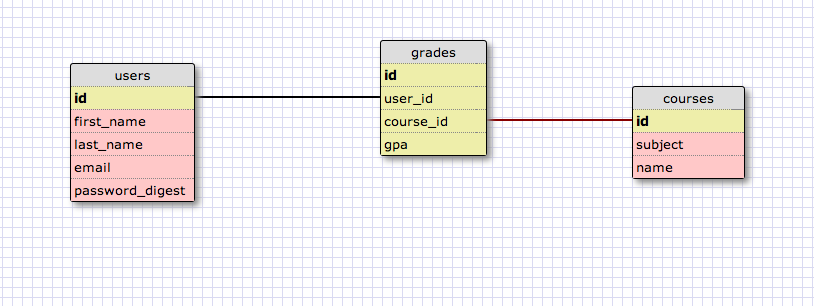

#5 Day Project - SCHOOL.IO

##MVP

- build a simple app in which users (students) can enter their grades and track progress over time
- students can log in with a secure password, view a chart of their progress in a given subject, and that's pretty much it for now

## Schema

